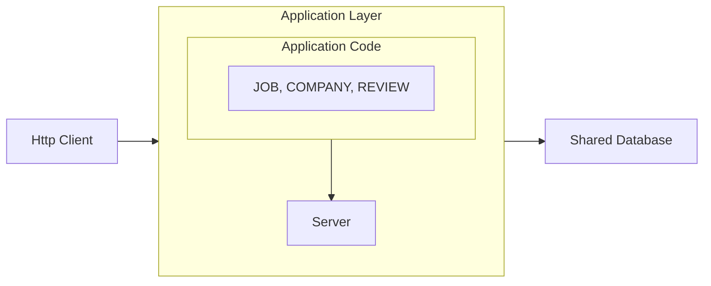

# JobAppApi

Basic **Spring Boot** API.

**Technical environment** :
* Docker Engine + Docker Compose (Docker Desktop)
* JDK17 / Maven / Tomcat
* Spring Boot / Spring Data JPA / PostgreSQL
* HTTP client
* Git


## Architecture



## Installation

```bash
git clone https://github.com/aty5/jobappapi.git
cd jobappapi
```

### DB config
1. docker-compose.yaml
```bash
POSTGRES_USER: CHOOSE_AN_USERNAME
POSTGRES_PASSWORD: CHOOSE_A_PASSWORD
```

2. application.properties
```bash
spring.datasource.url=jdbc:postgresql://localhost:5432/jobappapi
spring.datasource.username=CHOOSEN_USERNAME
spring.datasource.password=CHOOSEN_PASSWORD
```

```bash
docker compose up -d
```

3. Create the jobappapi database by :
    - Connect to pgadmin4 : http://localhost:5050

      OR

    - ```bash
      docker exec -it <postgre_container_ID> bash
      psql -U CHOOSEN_USERNAME
      CREATE DATABASE jobappapi;
      exit
      exit
      ```

4. Run the app
```bash
mvn spring-boot:run
```

## API Routes (Job Example)

| HTTP Method | Endpoint | Description |
|----------------|----------------|----------------|
| GET  | /jobs  | Retrieve all jobs |
| GET  | /jobs/{id}  | Retrieve job by ID  |
| POST  | /jobs  | Create a new job |
| PUT  | /jobs/{id}  | Update job by ID  |
| DELETE  | /jobs/{id}  | Delete job by ID |


**Example Request** :
```bash
POST /jobs
Content-Type: application/json

{
  "title": "Software Engineer",
  "description": "Develop and maintain software.",
  "minSalary": "50000",
  "maxSalary": "80000",
  "location": "Remote"
}
```

**Example Response** :
```bash
HTTP/1.1 201 Created
Content-Type: application/json

{
  "message": "Job added successfully.",
  "job": {
    "id": 1,
    "title": "Software Engineer",
    "description": "Develop and maintain software.",
    "minSalary": "50000",
    "maxSalary": "80000",
    "location": "Remote"
  }
}

```

## Check out the code to discover all the routes!
